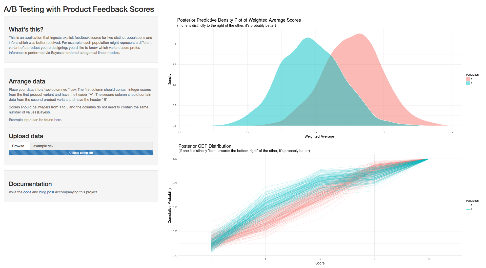

This work builds a Bayesian ordered categorical linear model to estimate the ordered multinomial distribution underlying explicit product feedback scores. "I'm testing website variants and have collected 50 feedback scores on the scale of 1-5: what's the *true* distribution of scores look like?" in effect. The model is then compared to a vanilla multinomial regression on the same data. In addition, it includes a [Shiny app](https://willwolf.shinyapps.io/ordered-categorical-a-b-test/) which A/B tests two distinct populations of ordered integer scores. An example of its output is given below.

Finally, this work is accompanied by a blog post which can be found at the following [link](http://wp.me/p4zXJT-hs).

  

